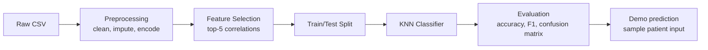
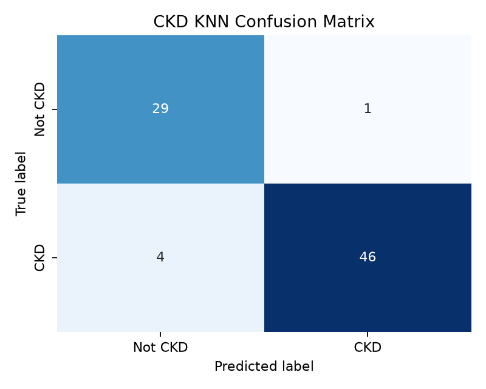
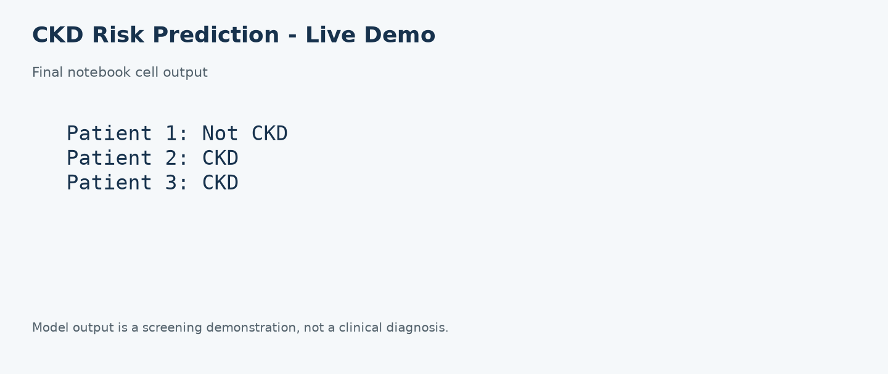

# CKD Risk Prediction - AI Mini Demo

[](https://www.python.org/)
[](LICENSE)
[](#)

## Overview

This project predicts chronic kidney disease (CKD) risk from a small set of laboratory and patient-history features using a lightweight K-nearest neighbors (KNN) classifier. It demonstrates an early, low-cost screening workflow that can help identify patients who may need further clinical assessment. The project is intentionally a partial implementation of a larger hybrid CKD risk-prediction reference model. It is an academic demo, not a diagnostic medical tool.

## Tech Stack

- Python 3.x
- pandas and numpy
- scikit-learn
- matplotlib and seaborn
- Jupyter Notebook
- joblib for model persistence
- GitHub Codespaces for a reproducible environment

## Architecture



## Dataset

The data comes from the [UCI Chronic Kidney Disease dataset](https://archive.ics.uci.edu/dataset/336/chronic+kidney+disease), also available through Kaggle mirrors. The UCI release used here contains 400 records, 24 clinical predictor fields, and one class label (`ckd` or `notckd`). Some assignment descriptions count additional identifiers or derived fields and refer to 29 original features; this repository reports the exact UCI release used so the result is reproducible.

The five selected features are computed by `src/feature_selection.py` rather than hard-coded. On the included dataset they are the five predictors with the largest absolute Pearson correlation with the encoded class label:

| Feature | Absolute correlation |
| --- | ---: |
| `hemo` | 0.726368 |
| `pcv` | 0.673129 |
| `sg` | 0.659504 |
| `htn` | 0.590438 |
| `rbcc` | 0.566163 |

The script prints these scores and writes them to `data/selected_features.csv`.

## How It Works

1. `src/preprocess.py` loads the raw CSV, drops rows with excessive missingness, fills numeric values with medians, fills categorical values with modes, and encodes categorical fields.
2. `src/feature_selection.py` computes feature/target correlations, selects the top five predictors, and writes the reduced dataset.
3. `src/train.py` performs a stratified 80/20 split, trains one KNN model with `n_neighbors=5`, prints metrics, and saves `models/knn_ckd.pkl` plus the test split.
4. `notebooks/demo.ipynb` loads the saved model, plots the confusion matrix, prints a classification report, and predicts labels for manually entered sample patients.

## Setup & Run

```bash
git clone https://github.com/Regemsol/ckd-risk-demo.git
cd ckd-risk-demo
python -m venv .venv
source .venv/bin/activate
pip install -r requirements.txt
python src/preprocess.py
python src/feature_selection.py
python src/train.py
jupyter notebook notebooks/demo.ipynb
```

Alternatively, open the repository in GitHub Codespaces. The included `.devcontainer/devcontainer.json` installs the requirements during container creation.

## Sample Output

Run `python src/train.py` to regenerate the metrics below from the committed data:

```text
Accuracy: 0.9375
Precision: 0.9787
Recall: 0.9200
F1-score: 0.9485
Confusion matrix:
[[29  1]
 [ 4 46]]
```



## Application Screenshot



## Demo Walkthrough

1. Show the raw dataset and the five selected features.
2. Run `train.py` live and explain the accuracy, precision, recall, F1-score, and confusion matrix.
3. Open `notebooks/demo.ipynb` and run the final live-prediction cell.
4. Explain that the predicted label is a model screening output for that sample, not a clinical diagnosis.

## Reference Paper

Yordan et al., “Hybrid AI-Based Chronic Kidney Disease Risk Prediction,” *2023 Innovations in Intelligent Systems and Applications Conference (ASYU)*, IEEE. DOI: [10.1109/ASYU58738.2023.10296642](https://doi.org/10.1109/ASYU58738.2023.10296642).

This repository implements a single-classifier subset of the paper’s full KNN+SVM+EBT hybrid approach for CIA-1 Part 5.

## Student Details

| Name | Roll No | Class/Div |
| --- | --- | --- |
|  |  |  |

## License

This project is released under the MIT License. See [LICENSE](LICENSE).